# ubuntu系统上Kubernetes(K8S)运维环境快速搭建
    Java语言,spring-boot项目,Git版本管理

## 设置root初始密码
```text
sudo passwd root
输入ROOT密码
```

## 相关工具

- 搜狗输入法安装(官网)
[安装教程](https://pinyin.sogou.com/linux/?r=pinyin)
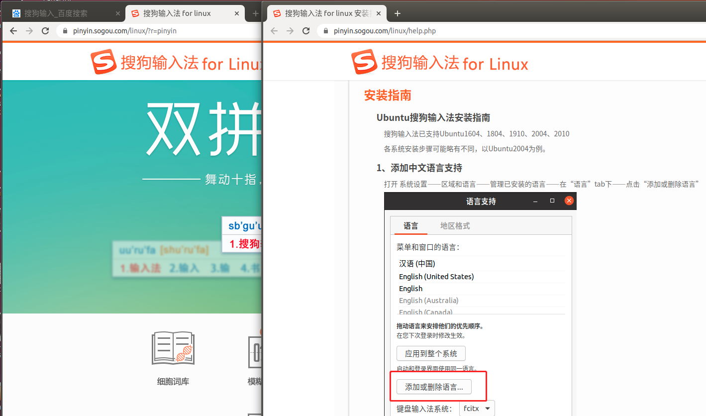
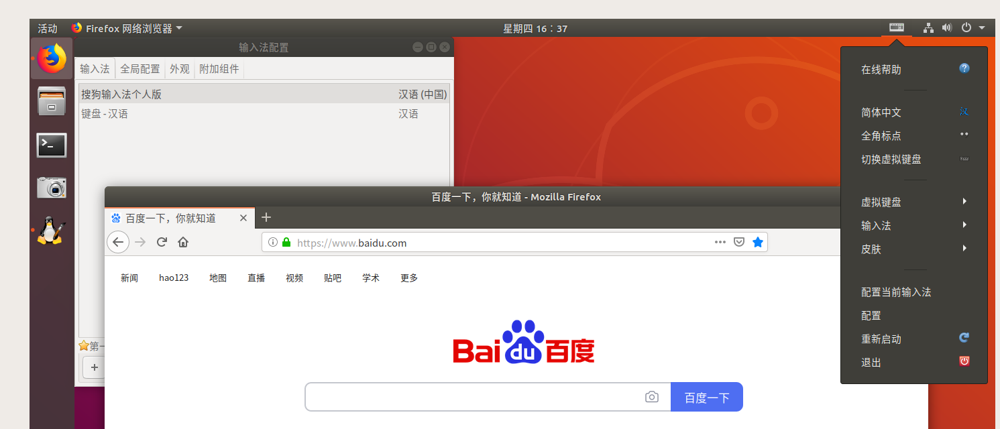
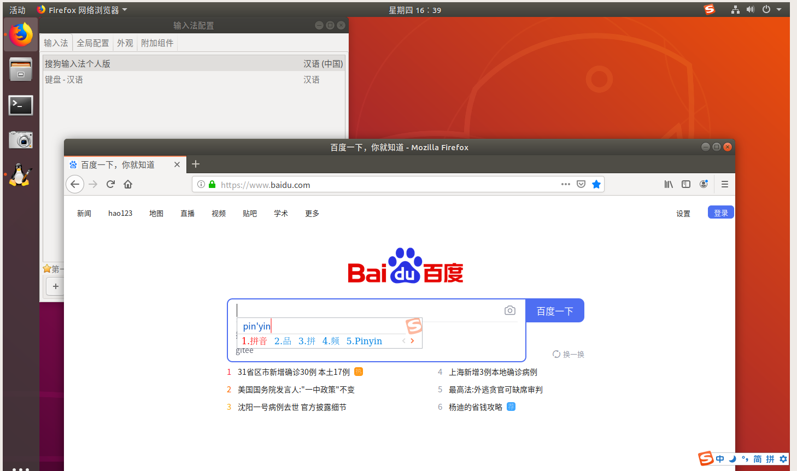

- 开启`curl`命令支持
```text
  sudo apt install curl
```
- `make`工具安装
```text
sudo apt install make
```
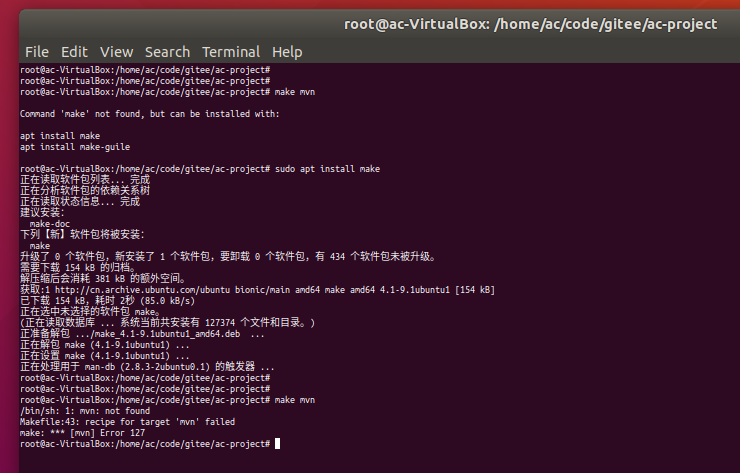

## `maven安装(非离线方式)`
- 步骤
```text
不指定版本安装,可直接完成maven,jdk安装
sudo apt install maven
maven配置阿里云镜像(conf/settings.xml)
```
- 阿里云镜像
```text
 <mirror>
    <id>nexus-aliyun</id>
    <mirrorOf>central</mirrorOf>
    <name>Nexus aliyun</name>
    <url>http://maven.aliyun.com/nexus/content/groups/public</url>
 </mirror>
```
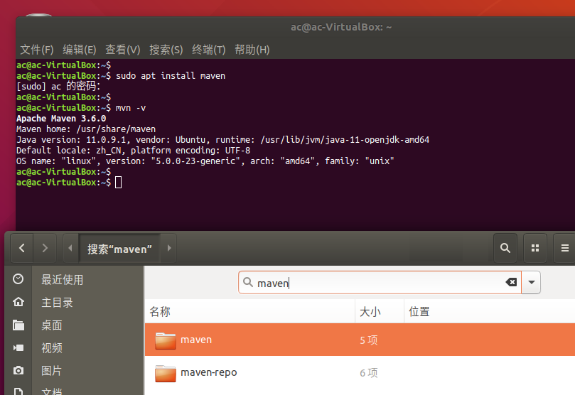
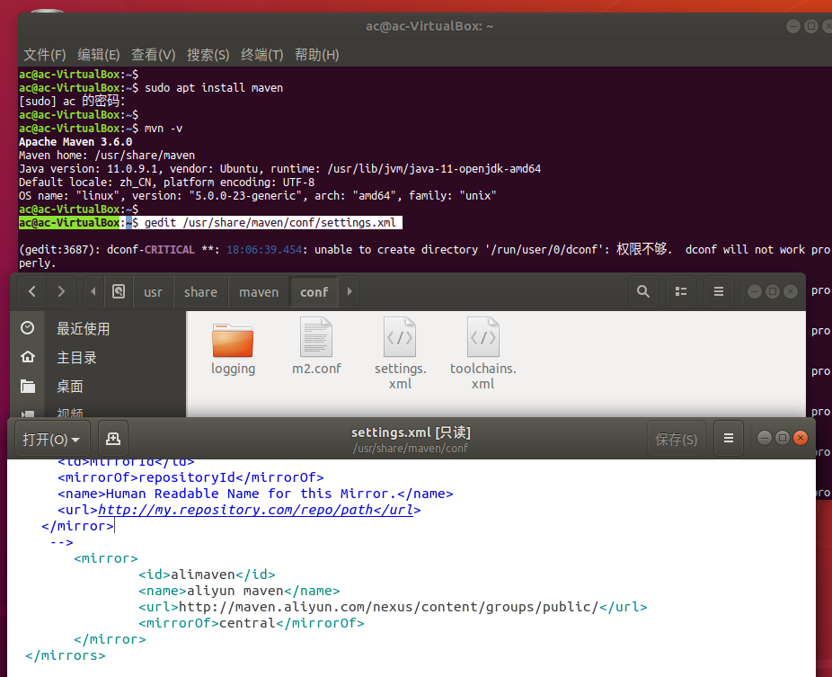

## 安装`git`
- 安装
```text
sudo apt install git
git --version
```
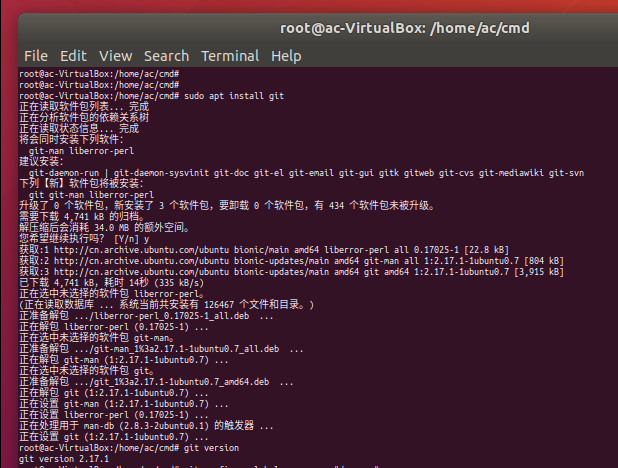

- 配置`git`ssh访问(使用非ROOT账号)
```text
git config --global user.name "dev-ops"
git config --global user.email "dev-ops@xxx.c"
git config --list
ssh-keygen -t rsa -C "dev-ops@xxx.c"
gedit id_rsa.pub
复制文件(id_rsa.pub)内容至代码库,即可拉取代码 
```
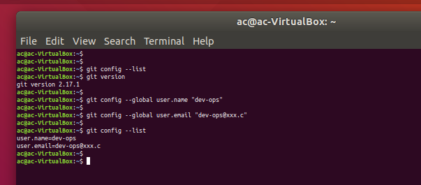
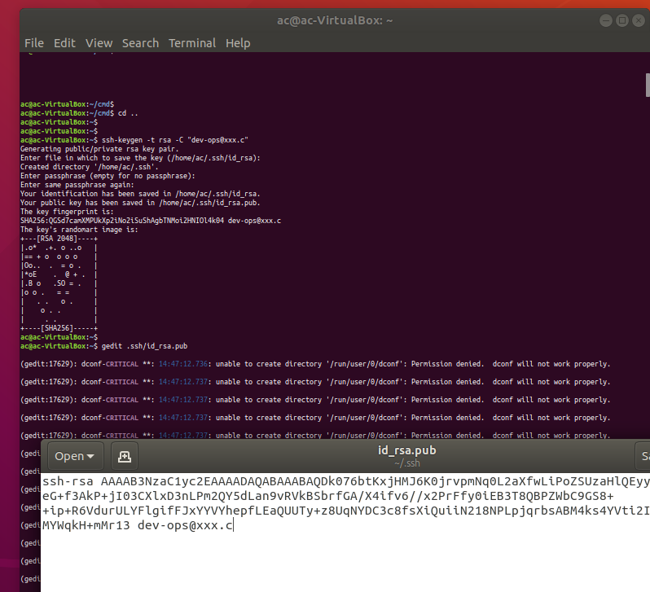

## 安装`docker(官方脚本)`
[阿里云参考文档](https://developer.aliyun.com/article/110806)
```text
curl -fsSL https://get.docker.com | bash -s docker --mirror Aliyun
```
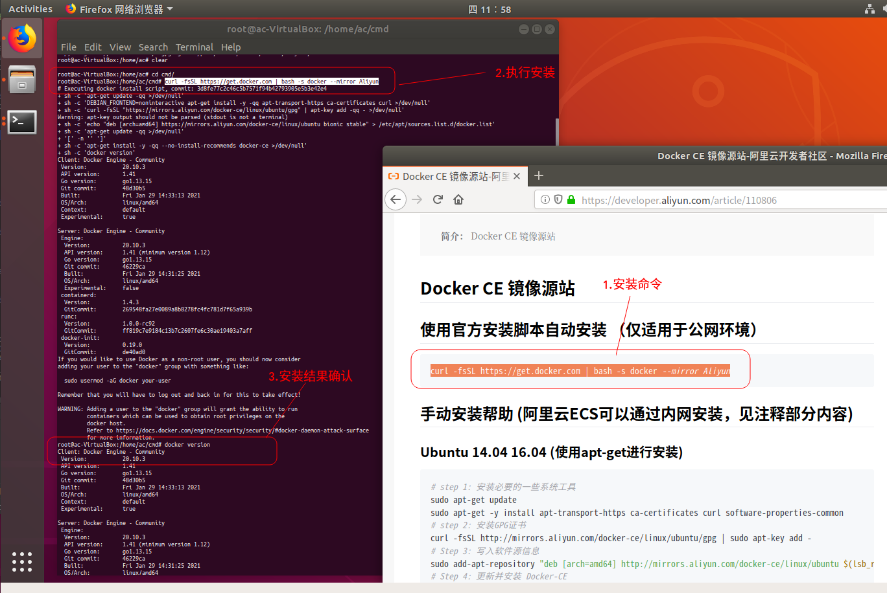

- 安装`kubectl(在线下载方式)`
[安装文档](https://www.kubernetes.org.cn/installkubectl)
```text
下载执行文件
mv kubectl /usr/local/bin
chmod +x /usr/local/bin/kubectl
配置服务端信息至.kube/config文件
```
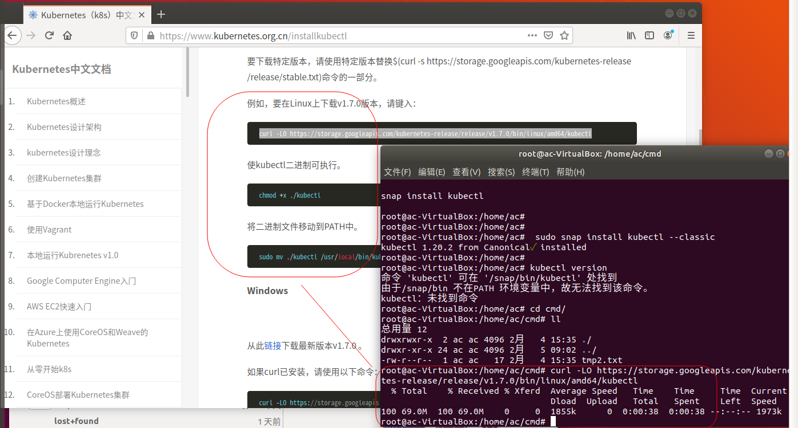

## 安装`kustomize工具(离线方式)`
[官方文档](https://github.com/kubernetes-sigs/kustomize/releases)
```text
下载执行文件
mv kustomize /usr/local/bin
chmod +x /usr/local/bin/kustomize
```
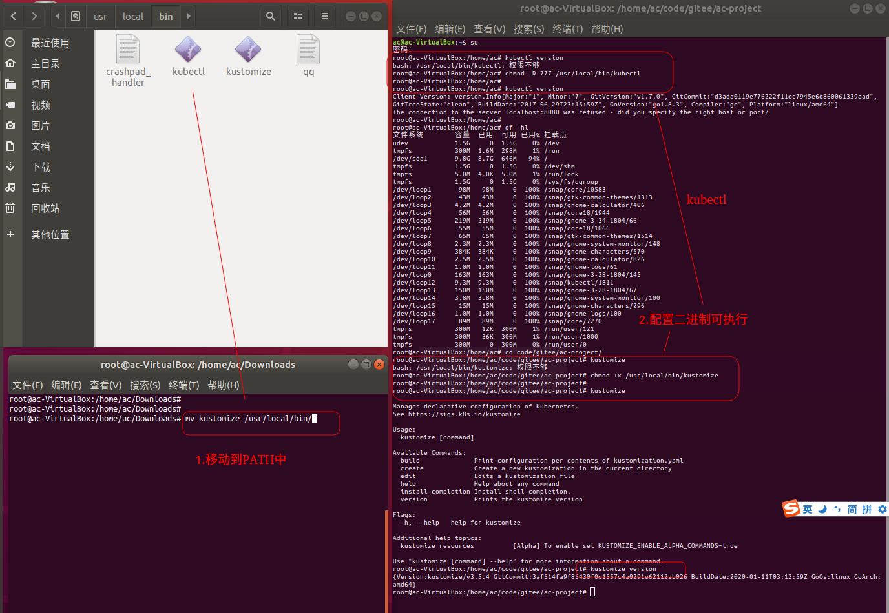